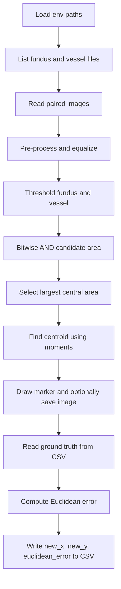

# Optic Disk Detector

Python project for optic disk center detection in retinal fundus images using image processing with vessel maps, followed by Euclidean error evaluation against reference coordinates.

## Problem Resources

Add your official resources here:

- Problem statement: https://drive.google.com/file/d/1xvTBnUdXryx0gc81QQ88xEiakNcbi9NV/view?usp=sharing
- Dataset and input CSV: https://drive.google.com/drive/folders/1DxmL9I2772qTCYwlbMk1KpKPtJb85o-H?usp=sharing

## Project Goal

Given:

- A fundus (retina) image
- A corresponding blood vessel structure image
- Ground-truth optic disk centers from CSV

The pipeline estimates the optic disk center for each image, writes predicted coordinates, and computes per-image Euclidean error:

$$
	ext{error} = \sqrt{(x_{pred} - x_{true})^2 + (y_{pred} - y_{true})^2}
$$

## How It Works

### 1) Input loading

- Reads file names from fundus image folder and vessel image folder.
- Processes images pairwise in loop order.

### 2) Pre-processing

- Extracts red channel from fundus image.
- Applies histogram equalization to both red-channel fundus image and vessel image.

### 3) Candidate optic disk region

- Binary threshold on fundus intensity (bright regions).
- Binary threshold on vessel map.
- Bitwise AND to keep overlapping candidate region.
- Connected-region style selection to keep the largest central white area.

### 4) Center estimation

- Finds contours on selected region.
- Computes centroid from contour moments.

### 5) Visualization and save

- Draws a cross marker at predicted center.
- Saves output image (if output directory path is configured).

### 6) Error calculation

- Reads reference center for that image from CSV.
- Writes new columns to CSV:
	- new_x
	- new_y
	- euclidean_error

## Pipeline Flow



## Project Structure

```text
.
|-- main.py                 # entry point, loops through image pairs
|-- processing.py           # image processing and center estimation
|-- calculation.py          # CSV lookup and Euclidean error update
|-- constants.py            # loads .env variables
|-- requirements.txt
|-- .env.example
|-- optic_disc_centres.csv  # input + output-updated CSV
|-- Fundus image/           # retina images
|-- Blood vessels/          # vessel structure images
|-- Output/                 # saved processed images
```

## Requirements

- Python 3.9+
- OpenCV
- NumPy
- Pandas
- python-dotenv

Install dependencies:

```bash
pip install -r requirements.txt
```

## Environment Setup

1. Create .env from .env.example.
2. Fill all variables.
3. Keep trailing slash for directory paths used in image loading/saving.

Example template:

```env
# Fundus Images Directory
FUNDUS_IMAGES_PATH=./path-to-fundus-images/

# Vessel Structure Images Directory
VESSEL_STRUCTURE_PATH=./path-to-vessel-images/

# Optic Disc Centers CSV Path
RESULT_CSV_PATH=./optic_disc_centres.csv

# Output Images Directory
RESULT_PATH=./Output/
```

## CSV Format

Expected input columns:

- image
- x
- y

Generated/updated columns:

- new_x
- new_y
- euclidean_error

## Usage

Run:

```bash
python main.py
```

Execution behavior:

- Opens processed image windows with predicted center marker.
- Updates CSV with predictions and error values.
- Saves output images if RESULT_PATH is set.

## Notes and Assumptions

- Fundus and vessel files are paired by loop order, not by explicit filename matching.
- Directory paths should include trailing slash because current code concatenates strings directly.
- If an image name is missing in CSV, execution raises an error.

## Troubleshooting

- Empty/invalid path in .env: verify all required variables are set.
- No output images: verify RESULT_PATH exists and is writable.
- CSV not updating: verify RESULT_CSV_PATH points to the correct file.
- Incorrect pairing: ensure both image directories contain files in matching order.
